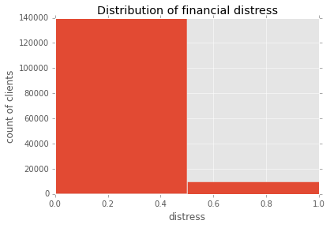

% Projekt-Bericht und Dokumentation im Kurs Ausgewählte Kapitel sozialer Webtechnologien (SoSe15) 
    Machine Learning 
% Claus Holland; Richard Remus
% 25. Juli 2015

#Einführung

Als wichtiger Teil des Wirtschaftslebens in einer Marktwirtschaft ist es die Aufgabe von Banken Kredite zu vergeben. Unternehmen können so zum Beispiel Investitionen finanzieren, wachsen und mit den hoffentlich erzielten Gewinnen ihren Kredit tilgen und wieder zurückzahlen. 
Doch auch Privatbürger nehmen Kredite auf, um sich etwa Wohnmobilen zu kaufen oder andere Anschaffungen zu tätigen. Wohneigentum kann wiederum mit Hypotheken belastet werden, dem Abtreten von Rechten an einer Immobilie im Gegenzug für ein Darlehen. Unternehmen haben in der Regel Kapital in Form von Anlagen oder Ähnlichem. Gerade wenn eine Privatperson aber nicht mit viel Besitz für einen Kredit haften kann, stehen Banken vor einer schwierigen Aufgabe. Sie müssen bei Abschluss eines Kreditvertrages entscheiden, wie zuverlässig der Kreditnehmer in der Zukunft sein wird. Auf Basis dieser Entscheidung bestimmen sie die Konditionen des Kredites oder entscheiden sich bei einem womöglich sehr hohen Ausfallrisiko sogar gegen eine Kreditvergabe. Damit entgeht ihnen aber womöglich ein einträgliches Geschäft.
Mit den Methoden des Maschinellen Lernens stehen Werkzeuge zur Verfügung, um mit beschränkten Aufwand verhältnismäßig sichere Aussagen zu treffen, die einen potenziellen Bankkunden anhand bestimmter Eigenschaften, sogenannter Features, hinsichtlich seines Kreditzahlungs-Ausfallrisikos beurteilen helfen. Dies soll im Rahmen dieser Arbeit aufgezeigt werden.
Es liegen uns 250.000 Datensätze von Bankkunden vor. Diese umfassen neben verschiedenen finanziellen und demografischen Angaben auch Werte zum Kredit-Ausfallverhalten. Es handelt sich somit um Trainingsdaten im Sinne des Maschinellen Lernens. Unsere Aufgabe besteht daher darin, Klassifikatoren zu implementieren, die anhand der gegebenen Werte am zuverlässigsten, also mit einer möglichst hohen Trefferquote, das Ausfallrisiko für die Datensätze korrekt vorhersagen.
Dafür analysieren wir den Datensatz erst einmal hinsichtlich bestimmter Auffälligkeiten und auch bezüglich der vorhandenen Datenqualität, führen also die sogenannte explorative Datenanalyse durch. Aus ihr ergeben sich idealerweise bereits erste Erkenntnisse, welche der Features besser als andere geeignet erschienen, um mit dem Ergebnis "Guter Kreditnehmer" oder "Risikoreicher Kreditnehmer" zu korrelieren. Anschließend wird auf Basis des ersten Punkts von uns der Datensatz optimiert. Ermittelte Schwachstellen werden wenn möglich kompensiert und Skalierungen so gewählt, dass bildliche Darstellungen, die sogenannten Plots eine möglichst hohe Aussagekraft beinhalten. Darauf folgt die Klassifikationsphase. In ihr werden wir geeignete Klassifikationsalgorithmen ermitteln und zur Anwendung bringen. Ergebnis soll ein Klassifikator sein, der den gewünschten Anforderungen, also einer hohen Trefferquote bei den Vorhersagen entspricht.  Eine Evaluation und ein Fazit schließen sich an.
Der Datensatz entstammt der Web-Platform "www.kaggle.com" und dort dem bereits beendeten Wettbewerb "Give me some Credit" aus dem Jahr 2011. Ziel dieses Belegs ist es allerdings nicht, die Wettbewerbskriterien auf kaggle zu erfüllen. Uns geht es darum, die Mächtigkeit der Werkzeuge des Machinellen Lernens zu demonstrieren, um realwirtschaftliche Probleme zu erfassen. Da uns auf kaggle keine geeigneten Testdaten zur Verfügung stehen, in denen ebenfalls das Kreditausfallrisiko in einer Form gegeben ist, dass die erfolgreiche Anwendung eines geeigneten Klassifikators bewiesen werden kann, nutzen wir stattdessen randomisierte Datensätze aus den Trainingsdaten zur  Verifizierung unserer Arbeit.

#Explorative Datenanalyse

Die Zielklasse ist _SeriousDlqin2yrs_, welche Aussage darüber trifft, ob der Kreditnehmer innerhalb zweier Jahre nach Vertragsschluss in ernsthafte Zahlungsschwiereigkeiten kam. Zunächst betrachten wir die Verteilung dieser Klasse auf den Trainingsdaten.

#Data Wrangling

#Erstellung der Modelle

##Logistic Regression
###Cross Validation

##Support Vector Machine

###Grid Search

##Random Forest

#Performancevergleich der Modelle

#Ergebnisse

#Fazit