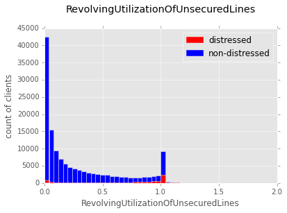
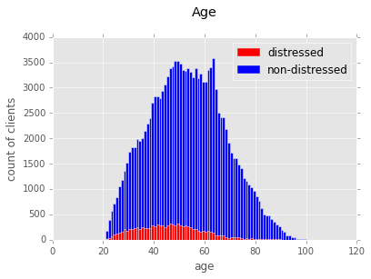
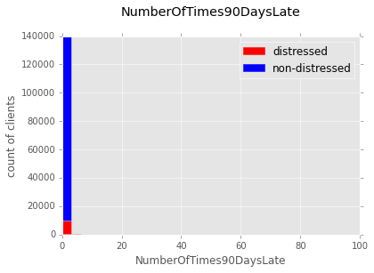
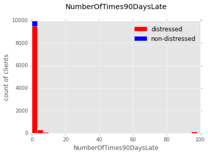

% Projekt-Bericht und Dokumentation im Kurs Ausgewählte Kapitel sozialer Webtechnologien (SoSe15) 
    "Machine Learning am Beispiel Kreditvergabe"
% Claus Holland; Richard Remus
% 28. Juli 2015


#Einführung

Als wichtiger Teil des Wirtschaftslebens in einer Marktwirtschaft ist es die Aufgabe von Banken Kredite zu vergeben. Unternehmen können so zum Beispiel Investitionen finanzieren, wachsen und mit den hoffentlich erzielten Gewinnen ihren Kredit tilgen und wieder zurückzahlen.

Doch auch Privatbürger nehmen Kredite auf, um sich etwa Wohnimmobilien zu kaufen oder andere Anschaffungen zu tätigen. Wohneigentum kann wiederum mit Hypotheken belastet werden, dem Abtreten von Rechten an einer Immobilie im Gegenzug für ein Darlehen. Unternehmen haben in der Regel Kapital in Form von Anlagen oder Ähnlichem. Gerade wenn eine Privatperson aber nicht mit viel Besitz für einen Kredit haften kann, stehen Banken vor einer schwierigen Aufgabe. Sie müssen bei Abschluss eines Kreditvertrages entscheiden, wie zuverlässig der Kreditnehmer in der Zukunft sein wird. Auf Basis dieser Entscheidung bestimmen sie die Konditionen des Kredites oder entscheiden sich bei einem womöglich sehr hohen Ausfallrisiko sogar gegen eine Kreditvergabe. Damit entgeht ihnen aber womöglich ein einträgliches Geschäft.

Mit den Methoden des Maschinellen Lernens stehen Werkzeuge zur Verfügung, um mit beschränkten Aufwand verhältnismäßig sichere Aussagen zu treffen, die einen potenziellen Bankkunden anhand bestimmter Eigenschaften, sogenannter Features, hinsichtlich seines Kreditzahlungs-Ausfallrisikos beurteilen helfen. Dies soll im Rahmen dieser Arbeit aufgezeigt werden.

Es liegen uns 150.000 Datensätze von Bankkunden vor. Diese umfassen neben verschiedenen finanziellen und demografischen Angaben auch Werte zum Kredit-Ausfallverhalten. Es handelt sich somit um Trainingsdaten im Sinne des Maschinellen Lernens. Unsere Aufgabe besteht daher darin, Klassifikatoren zu implementieren, die anhand der gegebenen Werte am zuverlässigsten, also mit einer möglichst hohen Trefferquote, das Ausfallrisiko für die Datensätze korrekt vorhersagen.

Dafür analysieren wir den Datensatz erst einmal hinsichtlich bestimmter Auffälligkeiten und auch bezüglich der vorhandenen Datenqualität, führen also die sogenannte explorative Datenanalyse durch. Aus ihr ergeben sich idealerweise bereits erste Erkenntnisse, welche der Features besser als andere geeignet erscheinen, um mit dem Ergebnis "Guter Kreditnehmer" oder "Risikoreicher Kreditnehmer" zu korrelieren. Anschließend wird auf Basis des ersten Punkts von uns der Datensatz optimiert. Ermittelte Schwachstellen werden wenn möglich kompensiert und Skalierungen so gewählt, dass bildliche Darstellungen, die sogenannten Plots, eine möglichst hohe Aussagekraft beinhalten. Darauf folgt die Klassifikationsphase. In ihr werden wir geeignete Klassifikationsalgorithmen ermitteln und zur Anwendung bringen. Ergebnis soll ein Klassifikator sein, der den gewünschten Anforderungen, also einer hohen Trefferquote bei den Vorhersagen, entspricht. Eine Evaluation und ein Fazit schließen sich an.

Der Datensatz entstammt der Web-Platform [www.kaggle.com](https://www.kaggle.com) und dort dem bereits beendeten Wettbewerb [_Give me some Credit_](https://www.kaggle.com/c/GiveMeSomeCredit) aus dem Jahr 2011. Ziel dieses Belegs ist es allerdings nicht, die Wettbewerbskriterien auf kaggle zu erfüllen. Uns geht es darum, die Mächtigkeit der Werkzeuge des Machinellen Lernens zu demonstrieren, um realwirtschaftliche Probleme zu erfassen. Da uns auf kaggle keine geeigneten Testdaten zur Verfügung stehen, in denen ebenfalls das Kreditausfallrisiko in einer Form gegeben ist, so dass die erfolgreiche Anwendung eines geeigneten Klassifikators bewiesen werden kann, nutzen wir stattdessen randomisierte Datensätze aus den Trainingsdaten zur Verifizierung unserer Arbeit.

#Explorative Datenanalyse
In den vorliegenden Daten finden primär zehn Features Verwendung, die die Bankkunden erfassen helfen und schließlich analysierbar machen:

##Berschreibung der Features

###`RevolvingUtilizationOfUnsecuredLines`

Dieser Prozentwert gibt an, inwiefern eine Person ihre Kreditkarte oder ihren Kreditrahmen tatsächlich in Anspruch nimmt, geteilt durch die Summe der Kreditlimits. Immobilien- und Sachkredite werden dabei nicht berücksichtigt.

###`age`

Das Alter der Bankkunden in Jahren, ein ganzzahliger Wert.

###`NumberOfTime30-59DaysPastDueNotWorse`

Ein ganzzahliger Wert, der angibt, wie oft ein Bankkunde innerhalb der zwei vorangegangenen Jahre 30 bis 59 Tage mit einer Ratenzahlung in Verzug geraten ist.

###`NumberOfTime60-89DaysPastDueNotWorse`

Ein ganzzahliger Wert, der angibt, wie oft ein Bankkunde innerhalb der zwei vorangegangenen Jahre 60 bis 89 Tage mit einer Ratenzahlung in Verzug geraten ist.

###`NumberOfTimes90DaysLate`

Ein ganzzahliger Wert, der angibt, wie oft ein Bankkunde innerhalb der zwei vorangegangenen Jahre mindestens 90 Tage mit einer Ratenzahlung in Verzug geraten ist.

###`MonthlyIncome`

Ein float-Wert, der das regelmäßige monatliche Einkommen des Bankkunden beschreibt.

###`DebtRatio`

Ein Prozentwert, der das Verhältnis von Tilgungszahlungen, Unterhaltsverpflichtungen und Lebenshaltungskosten im Vergleich zum monatlichen Bruttoeinkommen angibt.

###`NumberOfOpenCreditLinesAndLoans`

Ganzzahliger Wert, der die Anzahl offener Kredite und Darlehen, sowie Kreditkarten aufsummiert.

###`NumberRealEstateLoansOrLines`

Ein ganzzahliger Wert, der Kredite und Darlehen im Zusammenhang mit einer Wohnimmobilie zusammenfasst.

###`NumberOfDependents`

Die Summe der festen Haushaltsmitglieder des Bankkunden.

###`SeriousDlqin2yrs`

Ein elftes Feature stellt **`SeriousDlqin2yrs`** dar. Es handelt sich dabei um einen Binärwert, der die Datenmenge aufteilt in Personen mit bereits bewiesenen erheblichen Zahlungsschwierigkeiten und solchen ohne. Dies stellt auch die Zielklasse für die Klassifikation dar.

##Analyse der Datenkonsistenz

Im Rahmen der explorativen Analyse wird im Folgenden zunächst betrachtet, wie vollständig der Datensatz ist. 

__Fehlende Daten nach Kategorie__
```
    SeriousDlqin2yrs:                           0
    RevolvingUtilizationOfUnsecuredLines:       0
    age:                                        0
    NumberOfTime30-59DaysPastDueNotWorse:       0
    DebtRatio:                                  0
    MonthlyIncome:                          29731
    NumberOfOpenCreditLinesAndLoans:            0
    NumberOfTimes90DaysLate:                    0
    NumberRealEstateLoansOrLines:               0
    NumberOfTime60-89DaysPastDueNotWorse:       0
    NumberOfDependents:                      3924
```

Die Analyse zeigt, dass in den meisten Features die Angaben tatsächlich komplett sind. Da es sich um einen Datensatz von Bankkunden handelt, die mindestens einen Kredit bedienen, ist es allerdings verwunderlich, dass fast 30.000 mal die Angabe zum monatlichen Einkommen fehlt. Das betrifft fast 20 Prozent der Datensätze. Sollten die späteren Analysen ergeben, dass Einkommen ein relevantes Feature ist, so müssten im Rahmen einer Datenbereinigung möglicherweise diese Datensätze komplett entfernt werden.
Eine weitere Auffälligkeit im Datensatz gibt es nur bei den Angaben zu den Haushaltsmitgliedern, wobei hier die Fehlzahl mit knapp 4.000 vergleichsweise niedrig ausfällt.

`Number of people with financial distress: 10026`

Der bereits erwähnte Binärwert schlägt immerhin bei etwas mehr als 10.000 Datensätzen an. Dies sind die Kunden, die den Banken Kopfzerbrechen bereiten und am besten durch eine passende Einschätzung rechtzeitig erkannt und mit entsprechenden Kreditkonditionen als Risiko managebar gemacht werden.

\

Ein Histogramm dieser Personengruppe zeigt noch einmal deutlich, wie klein der Anteil der Bankkunden mit erheblichem Zahlungsverzug ist. Im Datensatz sind etwa sieben Prozent betroffen.

##Explorative Analyse der relevanten einzelnen Features

###RevolvingUtilizationOfUnsecuredLines



Bei diesem Feature ist der Input in einem Intervall von null bis zwei zu sehen. Dieses Intervall wurde auch aufgrund von Ausreißern gewählt. Es zeigt sich, dass die meisten Werte zwischen null und eins liegen, während die darüberlegenden Einträge anzeigen, dass die Kreditlimits überzogen wurden. Es lässt sich bereits an dieser Stelle der explorativen Analyse festhalten, dass es eine hohe Korrelation zwischen einem hohen Wert dieses Features und unserem Zielwert, den Ratenzahlungsproblemen, gibt.


###DebtRatio


Auch hier verteilen sich die meisten Werte im Bereich zwischen null und eins. Darüber liegende Werte zeigen an, dass die Kunden im Monat mehr für ihre Kredite bezahlen müssen, als sie an monatlichem Einkommen haben. Hier wäre also eine starke Korrelation zu Zahlungsproblemen zu vermuten. Ein Ausreißer der deutlich höher als zwei auf der Skala liegt und deshalb im Plot aus Gründen der besseren Visualisierung nicht berücksichtigt werden kann,  hat den Wert 329.664. Dies könnte bedeuten, dass die Person sehr hohe Schulden bei gleichzeitig minimalem Einkommen hat, oder einfach ein Fehler bei der Dateneingabe sein. Da aber 31.045 der Datensätze einen DebtRatio-Wert von über zwei haben, wird es im nächsten Schritt herausfordernd sein, Ausreißer in den Daten sinnvoll zu eliminieren. Die Daten scheinen bei diesem Feature schlecht ausbalanciert zu sein.
Als Ergänzung zu den Plots ergibt die Berechnung von Mittel- und Medianwerten eine mögliche Korrelation zwischen der DebtRatio und Zahlungsschwierigkeiten der Klienten.

```
    non-distressed
    Mode: 0.0
    Mean: 0.330567992607
    Median: 0.281137754

    distressed
    Mode: 0.0
    Mean: 0.411282121894
    Median: 0.344811491
```

###MonthlyIncome

\

Der Plot der Verteilung des monatlichen Einkommens zeigt viele Ausreißer, was auf ein Ungleichgewicht in den Daten schließen lässt, sonst aber wenig Auffälliges. Hier kommen die sehr vielen fehlenden Einträge zum tragen, die bereits bei der Datenkonsistenzanalyse festgestellt wurden. Der Datensatz selbst deckt ein großes Einkommensspektrum ab, so dass er insofern relevant ist, dass verschiedene Bevölkerungsgruppen berücksichtigt wurden. Die distress-Kurve folgt ebenfalls einfach der Einkommensverteilung und zeigt da höhere Werte, wo auch mehr Bankkunden gezählt wurden. 

Betrachten wir aber Modalwert, Mittelwert und Median 

```
    non-distressed
    Mode: 5000.0
    Mean: 6072.24517793
    Median: 5399.0

    distressed
    Mode: 3000.0
    Mean: 5186.20507528
    Median: 4470.5
```

Wird es recht deutlich, dass ein geringeres Einkommen auf ein höheres Risiko hinweist.

###Age

\

Annähernd normal-verteilt sieht es beim Feature Age aus.  In der Altersgruppe der 40- bis 60-Jährigen zeigt der Plot, dass trotz ähnlich hoher Zahl der Alterskohorten die jüngeren Kunden eher zu Zahlungsschwierigkeiten neigen. Vielleicht sind sie Risiko-freudiger als die älteren Bankkunden.

###Payment Delays

Unter Payment Delays lassen sich drei ausgesprochen ähnliche Features zusammenfassen. Sie entstammen einem Feature, den Zahlungsproblemen, und wurden in drei Kohorten aufgeteilt. Sie beschreiben alle die Häufigkeit von Zahlungsverspätungen der Bankkunden und unterscheiden sich nur nach der Art der Verspätung (kürzerer oder längerer Zeitraum). Für die Bank sind dabei die Kunden mit den gravierendsten Zahlungsproblemen am schwierigsten zu managen. 




Die Daten zeigen wenig überraschend, dass Kreditnehmer mit bedeutenden Zahlungsschwierigkeiten tendenziell auch ein Ausfallrisiko darstellen. Man könnte auch interpretieren, dass Personen, die immer wieder Zahlungsprobleme haben, schlecht mit ihrem Geld umgehen können.

###NumberRealEstateLoansOrLines


Die Plots zeigen erwartbare Ergebnisse. Die Zahl der Menschen, die viele Kredite im Zusammenhang mit ihrer Immobilie bedienen müssen, ist recht begrenzt. Da mit jeder Hypothek ein Anteil an der Immobilie an die Bank überschrieben wird, ist ihre Anzahl beschränkt durch den Wert der Immobilie.

###NumberOfDependents


Bei der Anzahl der Haushaltsmitglieder könnte man a priori vermuten, dass kinderreiche Haushalte eher Probleme mit Schulden haben, da das Einkommen auf mehr Köpfe verteilt werden muss. Dies lässt sich anhand der Daten jedoch nicht bestätigen, da auch Haushaltsmitglieder erfasst werden konnten, die zum Beispiel eigenes Einkommen haben und den Kreditnehmer daher finanziell nicht belasten. Die Korrelation zwischen distress und Zahl der Haushaltsmitglieder scheint durch die Verteilung von distress auf die Gesamtzahl der Datensätze überlagert zu werden.

Betracheten wir hier den Mittelwert, läßt sich gut erkennen, dass mit höherer Zahl der Haushaltsmitglieder auch das Risiko steigt.

```
    non-distressed
    Mean: 0.743417334048

    distressed
    Mean: 0.948207575911
```

#Data Wrangling

Die Beschaffenheit des Datensatzes hat uns vor ein paar Probleme gestellt. Zunächst lag für die als _cs-test.csv_ betitelten Daten keine Klassifikation vor, lediglich eine Beispieleinreichung mit Wahrscheinlichkeiten (_sampleEntry,csv_). Die Daten aus _cs-test.csv_ sollten also zur Erstellung einer Einreichung für die Leaderboards dienen. Dementsprechend mussten wir für Training und Validierung die 150.000 Datensätze aus _cs-training.csv_ verwenden.

Von diesen 150.000 Datensätzen verfügten 29.731 über NaN-Einträge. Für die Behandlung der betroffenen Zeilen haben wir zwei verschiedene Herangehensweisen gewählt:

- Data Cleaning: die NaN-Werte wurden durch den Spaltenmittelwert ersetzt. Dadurch soll verhindert werden, dass die fehlerhaften Zeilen keine starken Strömungen in den jeweiligen Kategorien ergeben.
- Data Cropping: Die Zeilen mit NaN-Werten wurden gelöscht.

Darüber hinaus haben wir unrealistische oder fehlerhaft erscheinende Extremwerte (Outliers) entfernt. Der erlaubte Wertebereich wurde hierbei durch ein Vielfaches der Standardabweichung bestimmt. Der jeweilige Faktor wurde für jede Klasse händisch ermittelt.

Aufgrund des starken Ungleichgewichts in der Zielklasse, haben wir ausserdem Oversampling und Undersampling angewendet. Beide Verfahren dienen dazu, einen möglichst ausgeglichenen Trainingsdatensatz zu erhalten.

- Undersampling: Aus dem Datensatz werden zufällig aus beiden Klassifikationen gleichviele Daten gewählt und als Trainingsdaten verwendet. Der Undersampling-Trainingsdatensatz hatte dementsprechend einen geringen Umfang.
- Oversampling: Es werden so oft Daten der unterrepräsentierten Klasse kopiert und angefügt, bis ein Gleichgewicht eintritt. Der Oversampling-Datensatz war also in unserem Fall geringfügig größer.

Für das Over-/Undersampling haben wir die bereits im Data Cleaning behandelten Daten gewählt, um einen möglichst großen Satz an Trainingsdaten zu erhalten.

#Erstellung der Modelle

Im Folgenden beschreiben wir die Modelle, welche wir für diese Aufgabe entwickelt haben. Die Ergebnisse wurden gleichermaßen nach Genauigkeit und ROC-AUC-Score (Fläche unter der Receiver Operating Curve) bewertet.

Das jeweilige Model wurde jeweils zehn Mal trainiert und getestet und der Mittelwert und der Standardfehler der Genauigkeit und der AUC ermittelt. Bei Logistic Regression und Random Forest wurde jeweils auf drei Vierteln der Daten trainiert und auf dem verbleibenden Viertel getestet. Bei der Support Vector Machine wurden zum Training jedoch nur ein Prozesnt der Daten verwendet, da die Dauer des Trainings quadratisch mit der Zahl der Samples skaliert und wir leider keine allzu leistungsfähigen Maschinen zur Verfügung hatten.

##Logistic Regression

Zunächst haben wir eine einfache Logistische Regression angewendet. Entgegen dem Namen handelt es sich dabei um eine Klassifikationsmethode und nicht um eine Regression, die abhängige und unabhängige Variablen in ihrem Verhältnis zueinander untersucht. Diese Generalisierung der linearen Regression wird verwendet, wenn die abhängige Zielvariable nicht stetig, sondern etwa binär ist, also nur zwei Zustände kennt. Dies ist bei unserer Untersuchung der Fall, da wir anhand verschiedener unabhängiger Variablen prognostizieren möchten, ob ein Kreditnehmer eine gute oder schlechte Zahlungsmoral hat. Die resultierende Wahrscheinlichkeit erlaubt eine Klassifizierung entlang einer Grenze von in der Regel 50 Prozent.

 Trainingsdaten | Genauigkeit           | Area-Under-Curve 
:---------------|----------------------:|-----------------------: 
 Cleaned        |__0.93345009 (+/-0.00045)__|0.69582843 (+/-0.00290)
 Cropped        |0.93118158 (+/-0.00032)|0.68944698 (+/-0.00207)
 Undersampled   |0.68908690 (+/-0.00364)|0.76162387 (+/-0.00377)
 Oversampled    |0.70956608 (+/-0.00710)|__0.78795195 (+/-0.00388)__

###Cross Validation

Um die Genauigkeit besser einschätzen zu können, haben wir die Ergebnisse 10-fach Kreuzvalidiert.

 Trainingsdaten | Genauigkeit           | Area-Under-Curve 
:---------------|----------------------:|-----------------------: 
 Cleaned        |__0.93310249 (+/-0.00036)__|0.69631654 (+/-0.00178)
 Cropped        |0.93024700 (+/-0.00039)|0.68822658 (+/-0.00157)
 Undersampled   |0.71425711 (+/-0.00286)|0.79303525 (+/-0.00286)
 Oversampled    |0.72424625 (+/-0.00071)|__0.80381864 (+/-0.00053)__

##Support Vector Machine

Eine Support Vector Machine (SVM) ist ein Klassifizierer, der Daten entlang einer durch Training optimierten Hyperebene klassifiziert. Mit ihrer Hilfe lassen sich neue Beispiele klassifizieren. Sie zeichnet sich dadurch aus, dass ihre Ermittlung ein mathematisches Optimierungsproblem darstellt, bei dem der sogenannte Margin, also der minimale Abstand zwischen den geeigneten Trainingsdaten maximiert wird. Prinzipiell ist das Verfahren für höherdimensionale Probleme geeignet, sollte aber auch Kreditkunden anhand weniger Features klassifizieren können.
Das Modellieren mit der Support Vector Machine, in unserem Falle ein _Support Vector Classifier_, war äußerst zeitaufwändig. Aus diesem Grund haben wir auch zunächst die Standardparameter von SciKitLearn beibehalten. Ausserdem mussten wir eine Feature-Skalierung durchführen, da die SVM in SciKitLearn einen zentrierten Datensatz erwartet. Dies ließ sich aber mit dem zur Verfügung gestellten `StandardScaler` leicht bewerkstelligen.

Da das Training mit der SVM so lang dauerte, haben wir eine GridSearch verwendet. GridSearch probiert alle Parameter in einem gegebenen Wertebereich iterativ aus und wählt dann diejenige SVM, die sich nach dem Scoring am besten geschlagen hat. 

###Grid Search

 Trainingsdaten | Genauigkeit           | Area-Under-Curve 
:---------------|----------------------:|-----------------: 
 Cleaned        |__0.93310601 (+/-0.00000)__|0.69885151 (+/-0.00110)
 Cropped        |0.93050522 (+/-0.00000)|0.49841584 (+/-0.01949)
 Undersampled   |0.50634576 (+/-0.00000)|__0.72650176 (+/-0.00001)__
 Oversampled    |0.61334848 (+/-0.00000)|0.66289212 (+/-0.00000)

Wir denken, dass ein Hauptgrund für die schlechte Performance der SVM die geringe Trainingsmenge ist. Als wir versuchsweise die Zahl der Samples iterativ erhöhten, ließ sich eine leichte Verbesserung in Genauigkeit und AUC-Score erkennen. Da dabei aber, wie schon erwähnt, die Rechenzeit quadratisch ansteigt, ist dieses Verfahren in unserem Falle jedoch äußerst unpraktikabel.

Ausserdem nutzten wir für den AUC-Score die Wahrscheinlichkeiten des jeweiligen Estimators. SVMs sind eigentlich nicht dafür ausgelegt Wahrscheinlichkeiten zu bestimmen, das Feature ist in SciKitLearn dennoch mittels 5-facher Kreuzvalidierung implementiert. Dadurch dauerte die Erstellung des Modells noch länger.

##Random Forest

Ein Random Forest Klassifikator setzt sich stets aus mehreren unkorrelierten Entscheidungsbäumen zusammen. Diese unterscheiden sich in der Teilmenge der gewählten Features aus der Gesamtmenge und können parallel berechnet werden, so dass sich etwa zur SVM ein deutlicher Geschwindigkeitsvorteil beim Trainieren ergibt. Der optimale Entscheidungsbaum klassifiziert die Subjekte in den Werten seiner Endknoten mit der größten Zuverlässigkeit. Da in unserem Datensatz die Zahl der Features recht gering ist, droht kein Overfitting durch einen zu tiefen Baum, was das Verfahren für die Klassifizierung von Kreditkunden geeignet erscheinen lässt. 


 Trainingsdaten | Genauigkeit           | Area-Under-Curve 
:---------------|----------------------:|-----------------: 
 Cleaned        |__0.93463729 (+/-0.00064)__|0.83709276 (+/-0.00154)
 Cropped        |0.93243658 (+/-0.00012)|0.81987760 (+/-0.00084)
 Undersampled   |0.76451742 (+/-0.00077)|0.84201142 (+/-0.00041)
 Oversampled    |0.69694936 (+/-0.00146)|__0.94609304 (+/-0.00057)__

Zusätzlich gibt ein Random Forest auch eine Bewertung der Wichtigkeit der einzelnen Features an, da er bei der Erstellung der Entscheidungsbäume alle Features nach ihrer Aussagekraft unterteilt, um die Baumknoten sinnvoll zu bilden.:

```
feature importance:
[ 0.19232936  0.12821367  0.04975155  0.17445648  0.14495428  0.08888198
  0.0938628   0.03415986  0.04830749  0.04508252]
```

Diese sind also:

1. RevolvingUtilizationOfUnsecuredLines
2. DebtRatio
3. MonthlyIncome
4. age
5. NumberOfOpenCreditLinesAndLoans
6. NumberOfTimes90DaysLate
7. NumberOfTime30-59DaysPastDueNotWorse
8. NumberOfTime60-89DaysPastDueNotWorse
9. NumberRealEstateLoansOrLines
10. NumberOfDependents

Wenig überraschend sind die Kreditbelastung und die Belastung des monatlichen Guthabens von höchster Wichtigkeit. Das Alter spielt doch eine größere Rolle als wir dachten. 

Als wir das unwichtigste Feature testweise ausgelassen haben, hat sich dies sofort schlecht auf den Random Forest Classifier ausgewirkt. Wir denken daher, dass der Feature-Raum der Ausgangsdaten schon auf das wesentliche beschränkt war. 

#Performancevergleich und Ergebnisse

Zunächst wollten wir uns nur auf das Genauigkeitsmaß beschränken, welches sich mit bei den jeweiligen Klassifikatoren in SciKitLearn leicht ermitteln läßt. Der ursprüngliche Wettbewerb auf [kaggle.com](https://www.kaggle.com/c/GiveMeSomeCredit) wurde jedoch nach der _Area Under Curve_ (AUC) der Receiver _Operating Characteristic_ bewertet. Deshalb haben wir uns entschieden, beide Metriken in den Vergleich aufzunehmen. 

Tatsächlich scheint die Bewertung nach ROC-AUC auch das bessere Mass zu sein (siehe [Huang et. al. - Using AUC and Accuracy in Evaluating Learning Algorithms
](http://www.cs.ust.hk/~qyang/537/Papers/AUC-evaluation.pdf)). Sie stellt die Richtig-Positiv-Rate und die Falsch-Positiv-Rate für alle möglichen Entscheidungsgrenzen gegenüber. Im Gegensatz dazu bewertet die Genaugkeit nur, wieviele korrekte Klassifikationen mit einer fixen Entscheidungsgrenze durchgeführt wurden. Die Bewertung mit AUC-Score ist also sehr viel allgemeiner.

Bei den Verfahren Random Forest und Logistic Regression haben wir zwar zunächst verschiedene Parameter ausprobiert, einen signifikanten Leistungsunterschied konnten wir jedoch eher bei den verschiedenen Formen der Trainingsdaten erkennen. Deshalb haben wir die Standardparameter beibehalten. 
Eine GridSearch für diese beiden Klassifikatoren könnte die Ergebnisse eventuell noch verbessern, jedoch haben wir am Beispiel der Support Vector Machine schon gemerkt, dass dieser Unterschied sehr gering ausfallen kann. GridSearch ist ebenfalls ein sehr zeitaufwändiges Verfahren.

Die Rangfolge der Klassifikatoren, geordnet nach bester Vorhersage, gestaltet sich wie folgt:

1. Random Forest
2. Logistic Regression
3. Support Vector Machine

Der Random Forest passt mit Abstand am besten auf die zugrunde liegenden Daten und ihre Features. Er hat sowohl nach Genauigkeit als auch nach AUC-Score deutlich am besten abgeschnitten.

Die Logistische Regression und die SVM müssten sich eigentlich den zweiten Platz teilen, wenn es nach dem Scoring geht, da die Logistische Regression den höheren AUC-Score hat, aber die SVM genauer ist. Nach anderen Eigenschaften ist die Logistische Regression aber besser:

- wir denken der AUC-Score trifft eine bessere Aussage über die Klassifikationsfähigkeit 
- sie ist deutlich schneller 

Speziell für die Bestimmung von Klassifikationswahrscheinlichkeiten sind SVMs eher unbrauchbar, wenngleich sie bei der reinen Klassifikation recht genau sind.

Wir haben bei allen Modellen die volle Zahl der vorhandenen Features genutzt. Das Weglassen von anscheinend weniger wichtigen Features hat sich schlecht auf die Vorhersagefähigkeit der Klassifikatoren ausgewirkt. Die Auswahl der gegebenen Features scheint auf das Wesentliche beschränkt zu sein. Jedoch könnte eine Hinzunahme anderer Merkmale, wie zum Beispiel die Art und auch die bisherige Dauer des Anstellungsverhältnisses der Klienten von Vorteil sein.

Betrachten wir die Vorverarbeitung der Trainingsdaten, fällt auf, dass die Genauigkeit auf dem bereinigten Datensatz am höchsten war. Für den AUC-Score war es jedoch besser, wenn die Daten durch Over- oder Undersampling in ein Gleichgewicht gebracht wurden.

Für den Anwendungsfall empfehlen wir einen Random Forest Classifier mit 100 Bäumen auf einem bereinigten Datensatz, d.h. die Fehldaten werden durch den Spaltenmittelwert ersetzt und Aussreisser durch ein passendes Vielfaches der Standardabweichung ausgegrenzt.

#Fazit

In diesem Beleg sollte demonstriert werden, dass eine Klassifizierungsaufgabe aus der Welt der Finanzwirtschaft mit den Mitteln des Maschinellen Lernens bewältigt werden kann. Dafür wurde ein Datensatz, der sich durch eine relativ geringe Anzahl von Features auszeichnete, untersucht, optimiert und mit mehreren Klassifizierungsalgorithmen näher untersucht. 

Es zeigte sich, dass Klassifizierer, in der Regel mit Standardparametern in SciKitLearn, dafür geeignet sind, mit einer recht hohen Zuverlässigkeit Zahlungsprobleme von potenziellen Kreditnehmern anhand weniger Features vorherzusagen. Dies wurde mit aus den Trainingsdaten vor dem Training extrahierten Testdaten belegt. Wenig üerraschend zeigen die Klassifizierer dabei unterschiedliche Genauigkeiten. Da insbesondere das Feature zum monatlichen Einkommen in den Datensätzen bei einer großen Anzahl an Einträgen einen NaN-Wert aufwies, mussten Spaltenmittelwerte gebildet werden. Auf die Präzision der Vorhersagen wirkte sich dies nicht negativ aus.

Ein Random Forest Klassifizierer hat in unseren Analysen die höchste Zuverlässigkeit auf dem gegebenen Datensatz gezeigt. Den Banken wäre also zu empfehlen, einen solchen zu trainieren und für die Klassifizierung ihrer Neukunden zu verwenden, um ihr Kreditgeschäft hinsichtlich der Häufigkeit von Zahlungsausfällen bei der Kredittilgung zu optimieren.

Da die uns zur Verfügung stehende CPU-Leistung nicht ausgereicht hat, eine Support-Vector-Maschine mit einem höheren Anteil des Datensatzes zu trainieren, bleibt für zukünftige Untersuchungen die Frage offen, ob sie tatsächlich bessere Ergebnisse im Vergleich zu einem Random Forest Klassifizierer zeigen würde.
